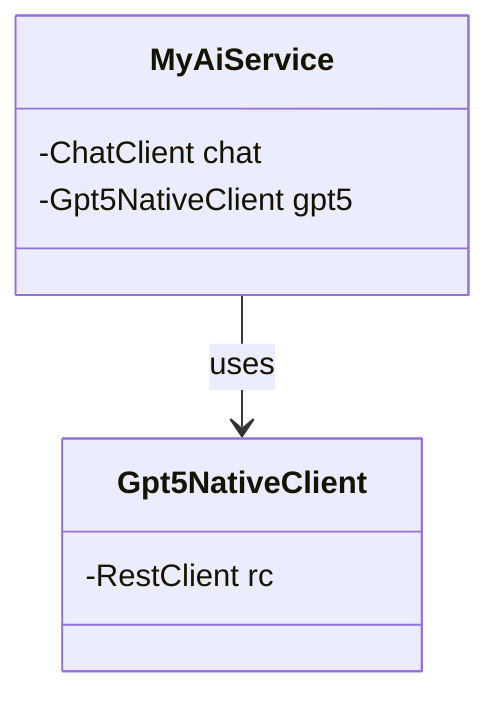
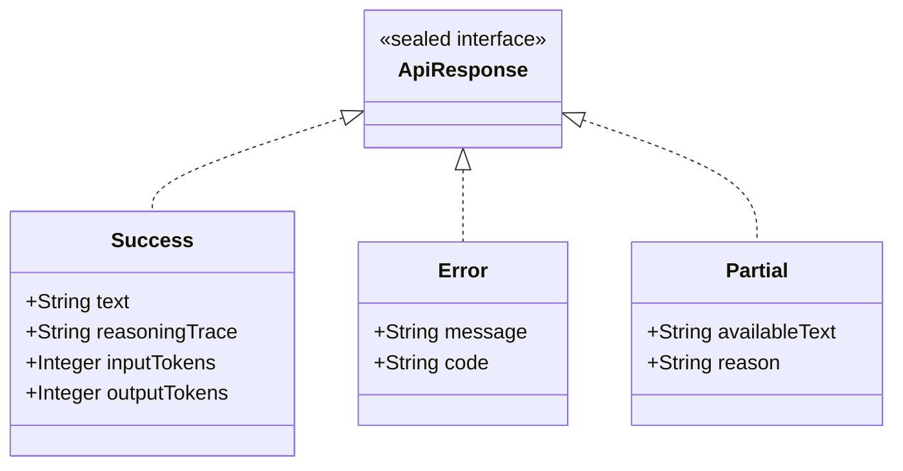

# GPT-5 Integration with Spring Boot

Modern Java 21 Development with OpenAI's Advanced Reasoning Models

<div class="pt-12">
  <span @click="$slidev.nav.next" class="px-2 py-1 rounded cursor-pointer" hover="bg-white bg-opacity-10">
    Press Space for next page <carbon:arrow-right class="inline"/>
  </span>
</div>

---
layout: section
---

# Two Paths to GPT-5

Comparing Spring AI vs Native Implementation

---

# Spring AI Approach
*Convenient but Limited*

<v-clicks>

- 🚀 **Quick Setup**: Built-in `ChatClient` integration
- 🔧 **Easy Configuration**: Properties-based setup
- ⚠️ **Limitations**: No reasoning output access
- 🌡️ **Required**: `temperature=1.0` for GPT-5 models

</v-clicks>

---

# Native RestClient Approach  
*Full Control & Access*

<v-clicks>

- 🎯 **Complete Access**: Full JSON response handling
- 🧠 **Reasoning Output**: Access to reasoning traces
- 🔄 **Flexible**: Custom request/response processing
- 💪 **Robust**: Advanced error handling patterns

</v-clicks>

---
layout: section
---

# Architecture Overview

Understanding the Dual Implementation Strategy

---

# Service Architecture

```java {1-8|10-14|16-20|all}
@Service
class MyAiService {
    private final ChatClient chat;          // Spring AI path
    private final Gpt5NativeClient gpt5;    // Native escape hatch

    MyAiService(ChatClient chatClient, Gpt5NativeClient gpt5) {
        this.chat = chatClient;
        this.gpt5 = gpt5;
    }

    // Spring AI approach - simple but limited
    public String normalAnswer(String prompt) {
        return chat.prompt(prompt).call().content();
    }

    // Native approach - full access to reasoning
    public ApiResponse gpt5ReasoningAnswer(String prompt, ReasoningEffort effort) throws Exception {
        return gpt5.chatWithReasoning(prompt, effort);
    }
}
```

---
layout: section
---

# Configuration Deep Dive

Setting Up Both Approaches

---

# Properties Configuration

```properties {1-4|all}
spring.ai.openai.api-key=${OPENAI_API_KEY}
spring.ai.openai.chat.options.model=gpt-5-nano
spring.ai.openai.chat.options.temperature=1.0
```

<v-clicks>

- 🌡️ **Temperature=1.0**: Required for GPT-5 models
- 🔑 **Unified API Key**: Single property used by both Spring AI and native clients
- 📝 **Model**: Can use `gpt-5` or `gpt-5-nano`

</v-clicks>

---

# Bean Configuration

```java {1-6|8-12|14-20|all}
@Configuration
class AiClientsConfig {
    @Bean
    ChatClient gpt5ChatClient(@Autowired OpenAiChatModel model) {
        return ChatClient.create(model);
    }

    @Bean
    ObjectMapper objectMapper() {
        return new ObjectMapper()
                .configure(DeserializationFeature.FAIL_ON_UNKNOWN_PROPERTIES, false);
    }

    // Native client configuration
    @Bean
    RestClient openAiRestClient(@Value("${spring.ai.openai.api-key}") String key) {
        return RestClient.builder()
                .baseUrl("https://api.openai.com/v1")
                .defaultHeader("Authorization", "Bearer " + key)
                .build();
    }
}
```

---
layout: section
---

# Modern Java 21 Features

Leveraging Advanced Language Capabilities

---

# Sealed Interface Definition

```java {1-6|all}
/**
 * Sealed interface representing different types of API responses from OpenAI.
 * This provides exhaustive pattern matching and type safety for response handling.
 */
public sealed interface ApiResponse 
        permits ApiResponse.Success, ApiResponse.Error, ApiResponse.Partial {
```

<v-clicks>

- 🔒 **Sealed**: Only permits specific implementations
- 🎯 **Type Safety**: Compiler ensures exhaustive handling
- 📋 **Three Response Types**: Success, Error, Partial

</v-clicks>

---

# Success Response Record

```java {1-8|all}
// Successful response containing the expected data
record Success(
        String text,
        String reasoningEffort,
        String reasoningTrace,
        Integer inputTokens,
        Integer outputTokens,
        JsonNode raw
) implements ApiResponse {}
```

<v-clicks>

- 📝 **text**: The actual response content
- 🧠 **reasoningEffort**: Level of reasoning used
- 🔍 **reasoningTrace**: Complete reasoning process
- 💰 **Token tracking**: Input/output for cost management

</v-clicks>

---

# Error & Partial Records

```java {1-6|8-14|all}
// Error response when the API call fails
record Error(
        String message,
        String code,
        JsonNode raw
) implements ApiResponse {}

// Partial response when some data is available but incomplete
record Partial(
        String availableText,
        String reason,
        JsonNode raw
) implements ApiResponse {}
```

---

# Simple Pattern Matching

```java {1-7|all}
public String gpt5TextAnswer(String prompt, ReasoningEffort effort) throws Exception {
    var response = chatWithReasoning(prompt, effort);
    return switch (response) {
        case ApiResponse.Success success -> success.text();
        case ApiResponse.Error ignored -> null;
        case ApiResponse.Partial partial -> partial.availableText();
    };
}
```

<v-clicks>

- 🎯 **Exhaustive**: All sealed interface cases covered
- 🔒 **Type Safe**: Compiler verifies completeness
- 📝 **Clean**: No casting or instanceof checks needed

</v-clicks>

---

# Advanced Pattern Matching

```java {1-8|9-15|all}
public ResponseSummary summarizeResponse(ApiResponse response) {
    return switch (response) {
        case ApiResponse.Success success -> {
            var tokenCount = (success.inputTokens() != null ? success.inputTokens() : 0) +
                           (success.outputTokens() != null ? success.outputTokens() : 0);
            yield new ResponseSummary(
                new ResponseSummary.SUCCESS(),
                success.text().length(),
                tokenCount,
                success.reasoningEffort()
            );
        }
        case ApiResponse.Error error -> new ResponseSummary(/* ... */);
        case ApiResponse.Partial partial -> new ResponseSummary(/* ... */);
    };
}
```

---

# Enhanced instanceof

```java {1-6|8-12|all}
static String extractText(JsonNode resp) {
    // Fast path with pattern matching instanceof
    if (resp instanceof JsonNode directNode && directNode.has("output_text")) {
        var outputText = directNode.get("output_text");
        if (!outputText.isNull()) return outputText.asText();
    }

    // Process output array with enhanced pattern matching
    var outputNode = resp.get("output");
    if (outputNode instanceof JsonNode output && output.isArray()) {
        // Process array items...
    }
    return firstText(resp, "/output/0/content/0/text", "/response/0/content/0/text");
}
```

---

# Switch Expressions

```java {1-10|all}
output.forEach(item -> {
    var itemType = item.path("type").asText();
    
    // Pattern matching for switch on item type
    switch (itemType) {
        case "message" -> processMessageContent(item, sb);
        case "function_call" -> processFunctionCall(item, sb);
        case "error" -> { /* Skip errors in partial responses */ }
        case null, default -> { /* Ignore unknown types */ }
    }
});
```

---
layout: section
---

# Native Implementation Deep Dive

Full Control with RestClient

---

# Simple Chat Method

```java {1-6|all}
/**
 * Quick single-message call with a reasoning knob.
 */
public ApiResponse chatWithReasoning(String userPrompt, ReasoningEffort effort) throws Exception {
    var messages = List.of(Map.of("role", "user", "content", userPrompt));
    return send(messages, effort);
}
```

---

# Text Block Request Construction

```java {1-8|10-16|all}
public ApiResponse send(List<Map<String, String>> messages, ReasoningEffort effort) throws Exception {
    var messagesJson = mapper.writeValueAsString(messages);
    var effortJson = mapper.writeValueAsString(effort.getValue());

    var body = """
            {
              "model": "%s",
              "input": %s,
              "reasoning": { "effort": %s }
            }
            """.formatted(model, messagesJson, effortJson);

    var resp = rc.post()
            .uri("/responses")
            .contentType(MediaType.APPLICATION_JSON)
            .body(body)
            .retrieve()
            .body(JsonNode.class);

    return parseApiResponse(resp);
}
```

---

# JsonNode.class Advantage

```java {1-7|9-12|all}
// RestClient returns raw JSON as JsonNode
var resp = rc.post()
        .uri("/responses")
        .contentType(MediaType.APPLICATION_JSON)
        .body(body)
        .retrieve()
        .body(JsonNode.class);  // ← Key advantage!

// Now use .at() to access ANY field in the response
var reasoningTrace = resp.at("/reasoning/trace").asText();
var inputTokens = resp.at("/usage/input_tokens").asInt();
var customField = resp.at("/any/nested/field").asText();
```

<v-clicks>

- 🔓 **Full Access**: Get the complete OpenAI response JSON
- 🎯 **JsonNode.at()**: Navigate to any nested field with JSON Pointer syntax
- 🆚 **vs Spring AI**: Limited to framework's response mapping

</v-clicks>

---

# Safe JSON Text Extraction

```java {1-8|all}
// Helper methods for safe JSON traversal
private static Optional<String> firstText(JsonNode root, String... pointers) {
    return Arrays.stream(pointers)
            .map(root::at)
            .filter(n -> n != null && !n.isMissingNode() && !n.isNull())
            .findFirst()
            .map(JsonNode::asText);
}
```

---

# JSON Navigation Helpers

```java {1-7|9-14|all}
private static Optional<JsonNode> firstNode(JsonNode root, String... pointers) {
    return Arrays.stream(pointers)
            .map(root::at)
            .filter(n -> n != null && !n.isMissingNode() && !n.isNull())
            .findFirst();
}

private static Optional<String> text(JsonNode node, String pointer) {
    return Optional.ofNullable(node)
            .map(n -> n.at(pointer))
            .filter(n -> !n.isMissingNode() && !n.isNull())
            .map(JsonNode::asText);
}
```

---

# Optional Usage Best Practice

```java {1-6|all}
// Extract metadata using Optional chain with meaningful defaults
var reasoning = firstNode(resp, "/reasoning", "/meta/reasoning");
var reasoningEffort = reasoning.flatMap(r -> text(r, "/effort")).orElse("unknown");
var reasoningTrace = reasoning.flatMap(r -> text(r, "/trace")).orElse("");

var inputTokens = intValue(resp, "/usage/input_tokens").orElse(0);
```

<v-clicks>

- ✅ **Helper methods return Optional** - no .orElse(null) in utilities
- 🔗 **flatMap chains Optionals** - clean composition of optional operations  
- 🎯 **Meaningful defaults** - "unknown", "", 0 instead of null values

</v-clicks>

---

# ReasoningEffort Enum

```java {1-5|7-15|all}
public enum ReasoningEffort {
    MINIMAL("minimal"),
    LOW("low"),
    MEDIUM("medium"),
    HIGH("high");

    private final String value;

    ReasoningEffort(String value) {
        this.value = value;
    }

    public String getValue() {
        return value;
    }
}
```

---

# Reasoning Levels

<v-clicks>

- 🚀 **MINIMAL**: Quick responses for simple queries
- 📝 **LOW**: Basic reasoning for straightforward questions  
- ⚖️ **MEDIUM**: Balanced reasoning for most use cases
- 🧠 **HIGH**: Deep reasoning for complex problems

</v-clicks>

**API Integration**
```java {1-7|all}
// Configure reasoning effort in request
var body = """
    {
      "model": "%s",
      "input": %s,
      "reasoning": { "effort": %s }
    }
    """.formatted(model, messagesJson, effortJson);
```

---
layout: section
---

# Response Parsing & Error Handling

Robust JSON Processing with Modern Java

---

# Error Detection

```java {1-10|all}
/**
 * Parse API response using advanced pattern matching features
 */
private ApiResponse parseApiResponse(JsonNode resp) {
    // Check for error first using pattern matching with instanceof
    if (resp instanceof JsonNode errorNode && errorNode.has("error")) {
        var errorInfo = errorNode.get("error");
        var message = errorInfo.path("message").asText("Unknown error");
        var code = errorInfo.path("code").asText("unknown");
        return new ApiResponse.Error(message, code, resp);
    }
    // ... continue processing
}
```

---

# Metadata Extraction

```java {1-12|all}
// Extract text using pattern matching
var text = extractText(resp);

if (text == null || text.isEmpty()) {
    return new ApiResponse.Partial("", "No text content available", resp);
}

// Extract metadata using pattern matching
var reasoning = firstNode(resp, "/reasoning", "/meta/reasoning");
var reasoningEffort = reasoning != null ? text(reasoning, "/effort") : null;
var reasoningTrace = reasoning != null ? text(reasoning, "/trace") : null;

var inputTokens = intOrNull(resp, "/usage/input_tokens");
var outputTokens = intOrNull(resp, "/usage/output_tokens");

return new ApiResponse.Success(text, reasoningEffort, reasoningTrace, 
                              inputTokens, outputTokens, resp);
```

---

# Content Processing

```java {1-15|all}
/**
 * Process message content using pattern matching
 */
private static void processMessageContent(JsonNode item, StringBuilder sb) {
    var contentArray = item.path("content");
    if (contentArray instanceof JsonNode content && content.isArray()) {
        content.forEach(contentItem -> {
            var contentType = contentItem.path("type").asText();
            
            switch (contentType) {
                case "output_text", "text" -> { /* Extract text */ }
                case "markdown" -> { /* Extract markdown */ }
                case null, default -> { /* Ignore unknown */ }
            }
        });
    }
}
```

---

# Function Call Processing

```java {1-7|all}
/**
 * Process function calls (placeholder for future extension)
 */
private static void processFunctionCall(JsonNode item, StringBuilder sb) {
    var functionName = item.path("function").path("name").asText();
    if (!functionName.isEmpty()) {
        sb.append("[Function: ").append(functionName).append("] ");
    }
}
```

---
layout: section
---

# Testing Strategies

Comprehensive Testing with Modern Tools

---

# Test Class Setup

```java {1-12|all}
@ExtendWith(MockitoExtension.class)
class MyAiServiceUnitTest {
    @Mock
    private ChatClient chatClient;
    
    @Mock
    private Gpt5NativeClient gpt5NativeClient;
    
    private MyAiService service;

    @BeforeEach
    void setUp() {
        service = new MyAiService(chatClient, gpt5NativeClient);
    }
}
```

---

# Mock-Based Testing

```java {1-12|14-22|all}
@Test
void shouldCallGpt5ReasoningAnswerWithDefaultEffort() throws Exception {
    // Given
    var expectedResponse = new ApiResponse.Success(
            "Data-oriented programming focuses on organizing code around data structures.",
            "medium", "reasoning trace", 100, 75, mapper.createObjectNode()
    );
    when(gpt5NativeClient.chatWithReasoning("Explain DOP", ReasoningEffort.MEDIUM))
            .thenReturn(expectedResponse);

    // When
    ApiResponse result = service.gpt5ReasoningAnswer("Explain DOP");

    // Then
    assertThat(result).isInstanceOf(ApiResponse.Success.class);
    if (result instanceof ApiResponse.Success success) {
        assertThat(success.text()).contains("Data-oriented programming");
        assertEquals("medium", success.reasoningEffort());
        assertEquals(Integer.valueOf(100), success.inputTokens());
        assertEquals(Integer.valueOf(75), success.outputTokens());
    }
}
```

---

# Error Response Testing

```java {1-10|12-20|all}
@Test
void shouldHandleErrorResponseInReasoningAnswer() throws Exception {
    // Given
    var errorResponse = new ApiResponse.Error(
            "API limit exceeded",
            "rate_limit",
            mapper.createObjectNode()
    );
    when(gpt5NativeClient.chatWithReasoning("test", ReasoningEffort.LOW))
            .thenReturn(errorResponse);

    // When
    ApiResponse result = service.gpt5ReasoningAnswer("test", ReasoningEffort.LOW);

    // Then
    assertThat(result).isInstanceOf(ApiResponse.Error.class);
    if (result instanceof ApiResponse.Error error) {
        assertEquals("API limit exceeded", error.message());
        assertEquals("rate_limit", error.code());
    }
}
```

---

# Partial Response Testing

```java {1-10|12-20|all}
@Test
void shouldHandlePartialResponseInReasoningAnswer() throws Exception {
    // Given
    var partialResponse = new ApiResponse.Partial(
            "Incomplete response due to...",
            "timeout",
            mapper.createObjectNode()
    );
    when(gpt5NativeClient.chatWithReasoning(any(), eq(ReasoningEffort.MEDIUM)))
            .thenReturn(partialResponse);

    // When
    ApiResponse result = service.gpt5ReasoningAnswer("complex question");

    // Then
    assertThat(result).isInstanceOf(ApiResponse.Partial.class);
    if (result instanceof ApiResponse.Partial partial) {
        assertThat(partial.availableText()).startsWith("Incomplete response");
        assertEquals("timeout", partial.reason());
    }
}
```

---

# Response Summary Testing

```java {1-12|14-17|all}
@Test
void shouldSummarizeSuccessResponse() {
    // Given
    var successResponse = new ApiResponse.Success(
            "This is a successful response with detailed information.",
            "high", "detailed reasoning trace", 150, 200, mapper.createObjectNode()
    );

    // When
    MyAiService.ResponseSummary summary = service.summarizeResponse(successResponse);

    // Then
    assertThat(summary.status()).isInstanceOf(MyAiService.ResponseSummary.SUCCESS.class);
    assertEquals(56, summary.contentLength()); 
    assertEquals(350, summary.totalTokens()); // 150 + 200
    assertEquals("high", summary.details());
}
```

---

# WireMock HTTP Testing
*"Don't Mock What You Don't Own"*

```java {1-12|14-20|all}
class Gpt5NativeClientUnitTest {
    private WireMockServer wireMockServer;
    private Gpt5NativeClient client;

    @BeforeEach
    void setUp() {
        wireMockServer = new WireMockServer(WireMockConfiguration.options().port(8089));
        wireMockServer.start();
        
        RestClient restClient = RestClient.builder()
                .baseUrl("http://localhost:8089/v1")
                .build();
        client = new Gpt5NativeClient(restClient, mapper, "gpt-5-nano");
    }

    @Test
    void shouldTestChatWithReasoningSuccess() {
        wireMockServer.stubFor(post(urlEqualTo("/v1/responses"))
                .willReturn(aResponse()
                        .withStatus(200)
                        .withBody(successJson)));
    }
}
```

<v-clicks>

- 🚫 **Anti-pattern**: Mocking Spring Framework classes (RestClient fluent API)
- ✅ **Solution**: WireMock runs real HTTP server for testing
- 📈 **Coverage boost**: From 34% to 94% for native client
- 🔧 **Real behavior**: Tests actual HTTP interactions

</v-clicks>

---

# Fluent Assertion Chaining

```java {1-10|12-16|all}
@Test
void shouldCallGpt5TextAnswer() throws Exception {
    // Given
    when(gpt5NativeClient.chatText("Why use Java for AI?", ReasoningEffort.HIGH))
            .thenReturn("Java provides strong typing, excellent performance, and rich ecosystem for AI applications.");

    // When
    String result = service.gpt5TextAnswer("Why use Java for AI?", ReasoningEffort.HIGH);

    // Then
    assertThat(result)
            .isNotNull()
            .contains("Java")
            .contains("AI");
}
```

---
layout: section
---

# Key Takeaways & Best Practices

Production-Ready GPT-5 Integration

---

# Spring AI Limitations

<v-clicks>

- 🌡️ **Temperature Requirement**: Must set `temperature=1.0` for GPT-5 models
- 🚫 **No Reasoning Access**: Cannot access reasoning traces or effort levels  
- 🔒 **Framework Constraints**: Limited to supported OpenAI parameters
- 🎯 **Best For**: Simple chat interactions without reasoning requirements

</v-clicks>

---

# Native Implementation Benefits

<v-clicks>

- 🧠 **Full Reasoning Access**: Complete reasoning traces and effort control
- 🔄 **Flexible JSON Handling**: Process any OpenAI response structure
- 🛠️ **Custom Error Handling**: Robust error processing with sealed interfaces
- 📊 **Token Tracking**: Access to input/output token counts for cost management
- 🎨 **Pattern Matching**: Clean, type-safe response processing

</v-clicks>

---

# Type Safety & Pattern Matching

<v-clicks>

- 🔒 **Sealed Interfaces**: Exhaustive pattern matching
- 🎯 **Pattern Matching**: Clean switch expressions
- 📝 **Records**: Immutable data structures
- ✅ **instanceof**: Enhanced type checking

</v-clicks>

---

# Code Quality Features

<v-clicks>

- 📄 **Text Blocks**: Readable JSON templates
- 🔤 **var**: Enhanced type inference
- 🛡️ **Optional**: Null-safe operations
- 🌊 **Stream API**: Functional data processing

</v-clicks>

---

# Production Considerations

<v-clicks>

- 💰 **Cost Management**: Track token usage with reasoning responses
- 🔧 **Configuration**: Externalize API keys and model settings
- 🚨 **Error Handling**: Implement robust retry and fallback mechanisms
- 📊 **Monitoring**: Log reasoning effort levels for performance analysis
- 🧪 **Testing**: 94% coverage with WireMock for HTTP testing
- 🔒 **Security**: Secure API key management and validation

</v-clicks>

---
layout: section
---

# Demo Architecture

Real-World Implementation Patterns

---

# Core Service Structure

<div class="flex justify-center">



</div>

---

# Response Type Hierarchy

<div class="flex justify-center">



</div>

---

# Spring Boot Testing Discovery
*What We Learned*

<v-clicks>

- 🚫 **@RestClientTest doesn't exist**: Only @RestTemplateTest exists in Spring Boot 3.x
- ⚠️ **MockRestServiceServer limitation**: Only works with RestTemplate, not RestClient
- 📚 **Documentation gap**: Spring Boot testing docs don't cover RestClient testing
- ✅ **WireMock solution**: Real HTTP server testing for RestClient
- 🎓 **Learning**: Sometimes framework limitations force better patterns

</v-clicks>

**Key Insight**: When Spring doesn't provide slice tests, external mocking libraries like WireMock often provide superior testing approaches.

---
layout: section
---

# Contact & Resources

Learn More About Modern Java & Spring

---
layout: center
---

# Thank You!

## Kenneth Kousen

- 📧 ken.kousen@kousenit.com
- 🐦 @kenkousen
- 🌐 kousenit.com

### Resources
- 📖 github.com/kousenit/SpringGPT5
- 🎥 YouTube: Kousenit Channel

<div class="pt-12">
  <span class="px-2 py-1 rounded cursor-pointer" hover="bg-white bg-opacity-10">
    🤖 Generated with Claude Code
  </span>
</div>